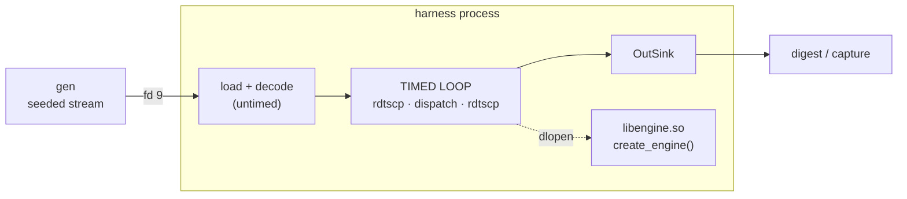
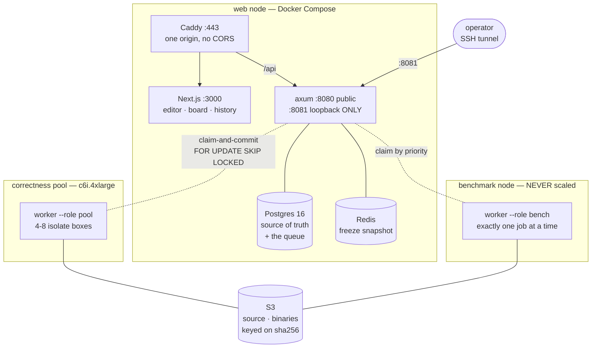
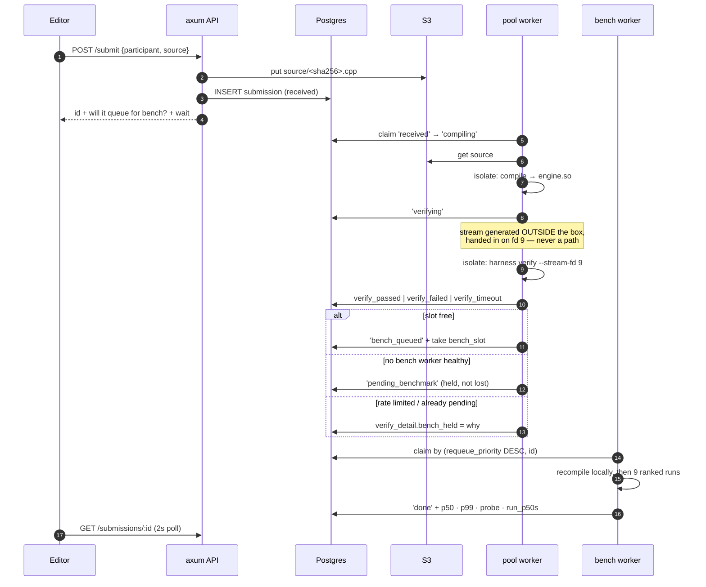
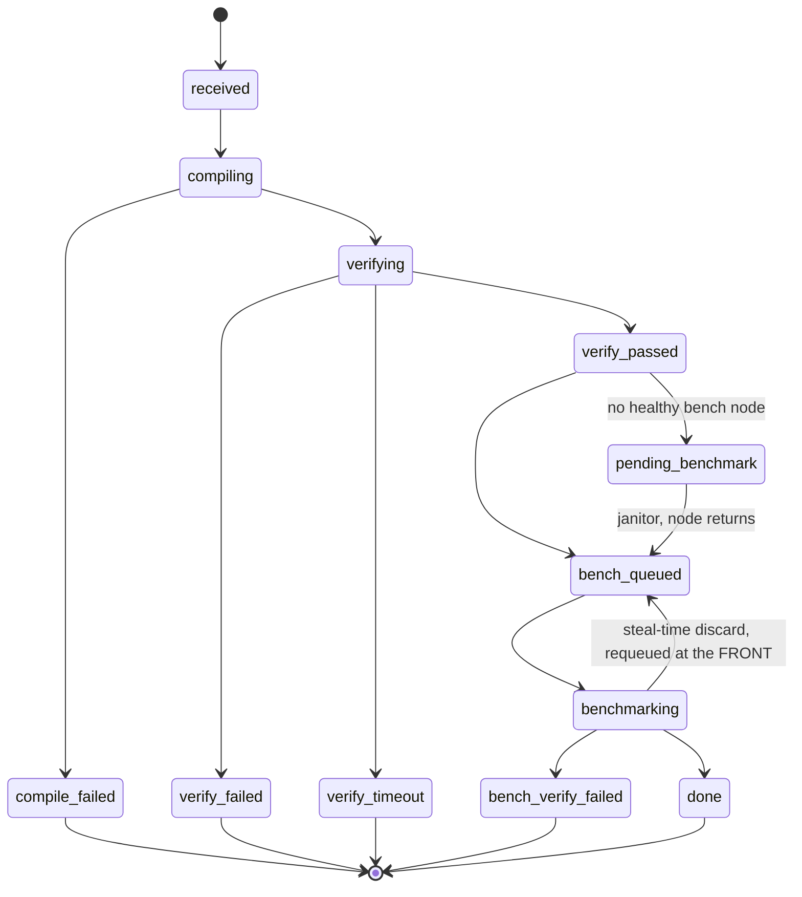
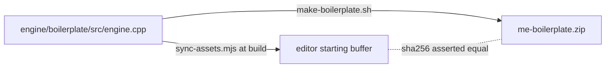
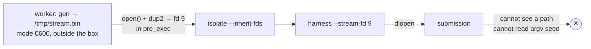
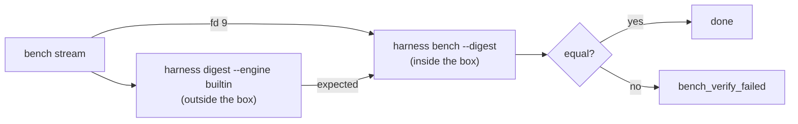

# Code walkthrough

How the pieces fit, what each file is for, and why the seams are where they are.
For *what state the project is in*, see [STATUS.md](STATUS.md).

---

## 1. The one idea everything follows from

Participants never write a `main()`. They implement a single function:

```cpp
extern "C" mebench::IMatchingEngine* create_engine();
```

That file is compiled to a shared object, and **the harness `dlopen`s it and
drives it**. The submission is *linked into* the measuring program rather than
run as a process whose stdout gets diffed.

That inversion decides almost everything downstream. It is why CMS and DOMjudge
were rejected (they diff stdout), why the hidden stream is a security problem
(it lives in the submission's own address space), and why a sandbox is required
even though nobody expects malice.



---

## 2. Architecture

Three roles on three nodes. The split exists because the three have
irreconcilable requirements: the web tier must be responsive, compiles are
bursty and CPU-heavy, and the benchmark must be *quiet*.



Two things that look like omissions and are not:

- **No message broker.** The queue is the `submissions` table. The claim *is*
  the state transition, so crash recovery is one janitor statement per stage
  rather than a protocol. At ~200 submissions across the event, a table is a
  perfectly good queue.
- **No auth code anywhere.** The operator router is a *separate* axum `Router`
  on a listener bound to `127.0.0.1`, reached over an SSH tunnel. Not a route
  prefix, not middleware, not a token. Verified refused from the LAN address.

---

## 3. The lifecycle of one submission



### The state machine



`verify_timeout`, `bench_verify_failed` and a crash are **separate outcomes on
purpose**. They are different bugs, and collapsing them into one red X wastes
the participant's debugging time.

---

## 4. Repo structure

```
me-platform/
├── spec/SPEC.md                    the normative specification
├── STATUS.md · WALKTHROUGH.md
│
├── engine/                         C++20 — the contest itself
│   ├── include/mebench/            FROZEN: the participant contract
│   ├── reference/                  the oracle
│   ├── generator/                  deterministic streams
│   ├── harness/                    verify · bench · digest
│   ├── common/decode.h             wire → hot-path, shared
│   ├── tests/                      41 visible tests + 5 broken engines
│   ├── boilerplate/                what participants start from
│   └── third_party/hdr/            vendored HdrHistogram, pinned
│
├── platform/
│   ├── db/001_schema.sql           whole data model
│   ├── common/                     types crossing the process boundary
│   ├── api/                        axum
│   ├── worker/                     pool + bench roles
│   ├── web/                        Next.js
│   ├── compose.yaml · Caddyfile
│   └── Cargo.toml                  workspace: common + api + worker
│
└── ops/                            provisioning · noise floor · runbook
```

---

## 5. Per-file summary

### `engine/include/mebench/` — the frozen contract

| File | | Role |
|---|--:|---|
| `wire.h` | 57 | On-disk format. `WireEvent` is 24 B **packed**; no `seq` field (the record index *is* the sequence, so they cannot disagree) and no timestamp. |
| `order.h` | 48 | `Order` 32 B **aligned**, `OrderRef` 16 B. Packed structs are for files, aligned for hot loops; neither is reused for the other. |
| `out.h` | 121 | `OutEvent` 56 B, `OutSink`, and `out::` constructors. Only three `RejectReason` values — each reachable by a rule. |
| `engine.h` | 53 | `IMatchingEngine` and `BookSnapshot`. `snapshot()` is called outside the timed region, so it costs nothing at benchmark time. |

### `engine/reference/` — the oracle

| File | | Role |
|---|--:|---|
| `reference.h` | 91 | `std::map<Price, std::list<Order>>` + a cancel index keyed on the **pair**. |
| `reference.cpp` | 217 | Every branch maps to a numbered spec rule. The two most-missed are commented hardest: trade price is the *resting* price, and FOK fillability *excludes the aggressor's own firm*. |
| `ref_plugin.cpp` | 13 | Exposes the reference through `create_engine()`, so the `dlopen` path is exercised by the same code that loads submissions. |

### `engine/generator/` — deterministic streams

| File | | Role |
|---|--:|---|
| `generator.h` | 187 | `Rng` with a hand-rolled `below()`. `mt19937_64` is portable; **its distributions are not**, so `uniform_int_distribution`/`shuffle`/`sample` are banned here. |
| `generator.cpp` | 567 | 4 profiles, session agents, price walk, and the 7 injections. Contains the two hard-won fixes: the clearing sweep before injected aggressors, and the live-list back-pressure that stopped unbounded depth growth. |
| `validate.cpp` | 285 | Runs the reference over a stream and checks it is worth trusting: fill rate, bounded depth, and every injection having its **intended effect** — not merely being present. |
| `gen_main.cpp` | 133 | The `gen` CLI. Ships to participants, so hidden streams are just unpublished seeds. |

### `engine/harness/` — how submissions are run

| File | | Role |
|---|--:|---|
| `harness_main.cpp` | 412 | Subcommands + the exit-code contract (0/1/2/3/4) the worker keys off. Carries the **seed-is-a-security-boundary** note. |
| `engine_loader.cpp` | 67 | `dlopen` + `dlsym("create_engine")`. Never `dlclose`s — unloading code under a live vtable is a segfault that looks like a submission bug. |
| `verify.cpp` | 556 | Lockstep diff, first divergence only, binary-search shrink, per-rule progress. |
| `invariants.cpp` | 339 | Rebuilds a shadow book from the engine's **own output** and cross-checks it against the engine's own snapshot — catches bugs the reference might share. |
| `bench.cpp` | 427 | `rdtscp` timing, HdrHistogram, steal-time, probe calibration, bootstrap CI, huge pages, `mlockall`. |
| `hash_sink.h` | 45 | FNV-1a folded **field by field**, never over raw struct bytes (padding would leak in). Covers every field. |
| `timing.{h,cpp}` | 83 | `rdtscp`, TSC calibration, `/proc/stat` steal time. |

### `engine/tests/`

| File | | Role |
|---|--:|---|
| `spec_tests.cpp` | 728 | 41 tests, one per rule, written against `IMatchingEngine` so the same file runs server-side and in the boilerplate. Expected outputs use the frozen `out::` helpers, so **every** field is compared. |
| `mutants.cpp` | 114 | Five engines built to fail, one per layer: wrong trade price, dropped `Expired`, forged self-trade, lying snapshot, unbounded loop. |
| `run_tests_main.cpp` | 75 | Human output and `--json` for the editor's Run panel. |

### `platform/`

| File | | Role |
|---|--:|---|
| `db/001_schema.sql` | 112 | The whole data model. The queue is the `submissions` table. |
| `common/src/lib.rs` | 85 | `SubState` + the harness exit codes — both cross a process boundary, so they are defined once. |
| `api/src/routes.rs` | 395 | Participant routes. The rate limit is answered **at enqueue** and returned in the response. |
| `api/src/admin.rs` | 255 | Operator router: freeze, requeue, bench health, rebuild, **rejudge** (one shared seed for everyone). |
| `api/src/janitor.rs` | 139 | Crash recovery. Timeouts sit *above* each isolate wall-time, so it can only catch a dead worker. Every action → `events_log`. |
| `api/src/state.rs` | 185 | Leaderboard view, runtime-loaded bands, bootstrap CI. |
| `worker/src/roles.rs` | 773 | Both roles. Pool claims `run_jobs` first (Run is the iteration loop). Bench recompiles locally and pins a seed on rejudge. |
| `worker/src/sandbox.rs` | 298 | isolate. Carries `--processes=N` (attached form is **required**) and `crashed()` = `SG` only, since isolate reports `RE` for any non-zero exit. |
| `worker/tests/sandbox_integration.rs` | 229 | Four tests against real isolate, one per behaviour that was got wrong. |
| `web/scripts/sync-assets.mjs` | 75 | Generates the editor buffer from `engine/` and vendors Monaco locally. |
| `web/app/editor/page.tsx` | 291 | Monaco, header tabs, Run/Submit, autosave, polling. |
| `web/components/ResultsPanel.tsx` | 239 | Built around failure cases — that is where participants live. |

### `ops/`

| File | | Role |
|---|--:|---|
| `install-isolate.sh` | 125 | Pinned isolate + the `isolate` user with subuid ranges (upstream makes it deliberately non-system). |
| `pool-node-setup.sh` | 111 | Toolchain, build, install, one systemd unit per box. |
| `bench-node-setup.sh` | 198 | `--dedicated` or `--metal`. **Refuses to mark the node healthy if hygiene fails.** |
| `bench-hygiene.sh` | 131 | Asserts the things that have each corrupted a measurement: agents, timers, turbo, SMT, swap. |
| `noise-floor/` | 225 | Spread + soak + an analyzer that maps the result onto the hardware decision. |
| `make-boilerplate.sh` | 89 | Assembles the zip from canonical sources and asserts the skeleton hash matches. |
| `runbook.md` | 220 | Event day, commands first. Includes Known Limitations. |

---

## 6. The seams that matter

### One source of truth for the skeleton



Hand-copying is exactly how these drift, and the person who discovers it would
be a participant at hour three whose code compiles locally and not on the server.
Both paths are generated; the hash is asserted.

### How the hidden stream reaches the harness



Two exposures were closed here, both found rather than designed away: a seed on
`argv` is readable from `/proc/self/cmdline`, and a stream file placed in the box
directory sits in the submission's **own** directory. The generator is published,
so either one is complete foreknowledge of the stream.

### Verification inside the timed loop

The correctness lane and the ranked lane run *different* streams, so a
submission's own correctness digest cannot be what the ranked run reproduces.
Instead the bench node compares against the **oracle's** digest for the bench
stream:



The digest folds **every** field of every `OutEvent`, field by field. A partial
hash would let a submission emit the wrong `OutType` or `RejectReason` and still
match — and this is the only in-timed-run defence against winning by doing less
work.

---

## 7. Reading order

If you are picking this up cold:

1. `spec/SPEC.md` — everything else is downstream of it
2. `engine/include/mebench/*.h` — the contract, 279 lines total
3. `engine/reference/reference.cpp` — the rules as executable code
4. `engine/harness/verify.cpp` — how a submission is judged
5. `platform/db/001_schema.sql` — the queue and the state machine
6. `platform/worker/src/roles.rs` — where the two halves meet
7. `ops/runbook.md` — what actually happens on the day
