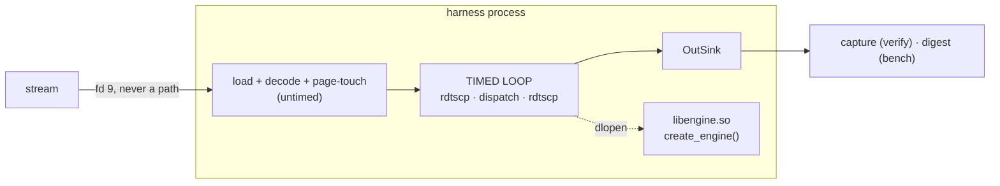
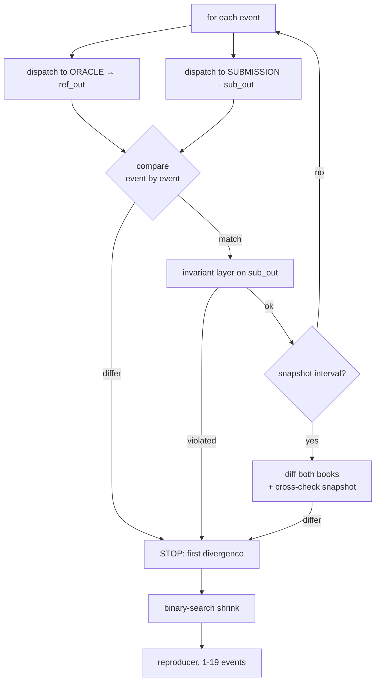
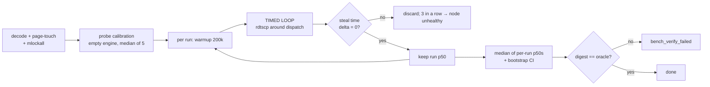
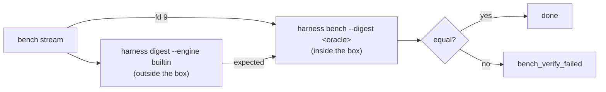

# The harness

2,205 lines across 12 files. This is the code that decides whether a submission
is correct and how fast it is, so it is the code most worth being suspicious of.

For the wider picture see [../../WALKTHROUGH.md](../../WALKTHROUGH.md); for
project state see [../../STATUS.md](../../STATUS.md).

---

## 1. The inversion everything rests on

Participants never write a `main()`. They implement one function:

```cpp
extern "C" mebench::IMatchingEngine* create_engine();
```

It is compiled to a shared object, and **the harness `dlopen`s it and drives
it**. The submission is *linked into* the measuring program rather than run as a
process whose stdout gets diffed.

Three consequences follow, and most of this document is downstream of them:

- The hidden stream lives in the submission's **own address space**, so seed
  handling becomes a security problem rather than a convenience question.
- A crash or a hang takes the harness with it, so the timeout must be
  asynchronous and the sandbox is mandatory even though nobody expects malice.
- Existing contest platforms (CMS, DOMjudge) cannot be used: their evaluation
  model runs a submission against input files and diffs stdout.



---

## 2. Three modes, one loader

```
harness verify --engine ENGINE [stream] [--wall-time S] [--json]
harness bench  --engine ENGINE [stream] [--runs N] [--digest HEX] [--json]
harness digest --engine ENGINE [stream]
```

| Mode | Sink | Answers |
|---|---|---|
| `verify` | captures every `OutEvent` | is it correct? where is the first divergence? |
| `bench` | folds a 64-bit digest, discards | how fast, and is it *still* correct while being timed? |
| `digest` | folds a digest | what should the ranked run reproduce? |

The `OutSink` swap is what lets one program do both jobs honestly. A capturing
sink would bias the benchmark: a 500-order sweep pays more memory traffic than
ten trades, so sink cost would correlate with the participant's own logic. The
digest sink costs the same regardless of output volume, so it cancels in
ranking.

---

## 3. Files

| File | | Role |
|---|--:|---|
| `harness_main.cpp` | 412 | CLI, the exit-code contract, `SIGALRM`, the seed security boundary |
| `engine_loader.{h,cpp}` | 98 | `dlopen` + `dlsym`; `builtin` returns the reference through the same interface |
| `verify.{h,cpp}` | 652 | lockstep diff, first divergence, binary-search shrink, progress categories |
| `invariants.{h,cpp}` | 393 | shadow book rebuilt from the engine's own output |
| `bench.{h,cpp}` | 522 | `rdtscp` timing, HdrHistogram, steal time, probe calibration, bootstrap CI |
| `timing.{h,cpp}` | 83 | `rdtscp`, TSC calibration, `/proc/stat` steal time |
| `hash_sink.h` | 45 | field-wise FNV-1a over every `OutEvent` field |

---

## 4. Loading a submission

```cpp
void* handle = dlopen(spec.c_str(), RTLD_NOW | RTLD_LOCAL);
void* sym    = dlsym(handle, "create_engine");
```

`RTLD_NOW` resolves everything up front — a missing symbol should fail at load,
not in the middle of a timed run. `RTLD_LOCAL` keeps the submission's symbols
out of the global namespace.

The destructor is empty on purpose:

```cpp
~SharedObjectSource() override {
  // Deliberately not dlclose()d: engines returned by the factory may still be
  // alive, and unloading the code underneath a live vtable is a segfault that
  // looks like a submission bug.
}
```

`--engine builtin` returns the reference through the *same* `EngineSource`
interface, so nothing downstream knows the difference. The reference is also
built as a `.so`, which means the `dlopen` path is exercised by exactly the code
that loads submissions rather than by a special case that could rot unnoticed.

---

## 5. verify — the correctness gate



### Lockstep, not stream-and-diff

```cpp
sub_out.clear();
ref_out.clear();
dispatch(*ref, d, ref_sink);
dispatch(*sub, d, sub_sink);
```

Both engines are driven one event at a time and compared immediately. That is
what lets the report say *"input seq 4,182"* rather than *"byte offset 300MB"* —
a byte offset into a 300MB diff is a useless error message.

### Three failures, three sentences

```cpp
for (size_t j = 0; j < n; ++j)
  if (!same(ref_out[j], sub_out[j])) { /* OutputDiverged: expected + actual */ }

if (!fail.failed && sub_out.size() != ref_out.size()) {
  if (ref_out.size() > n) message = "the submission emitted nothing more for this event";
  else                    message = "the submission emitted an output the spec does not call for";
}
```

Wrong output, missing output and extra output are different bugs.

### Shrinking

```cpp
// smallest prefix that still fails
uint64_t lo = 1, hi = end;
while (lo < hi && Clock::now() < shrink_deadline) {
  const uint64_t mid = lo + (hi - lo) / 2;
  if (diverges(0, mid)) hi = mid; else lo = mid + 1;
}

// then drop as much of the FRONT as the failure survives
uint64_t blo = 0, bhi = end - 1;
while (blo < bhi && Clock::now() < shrink_deadline) {
  const uint64_t mid = blo + (bhi - blo + 1) / 2;
  if (diverges(mid, end)) blo = mid; else bhi = mid - 1;
}
```

Two binary searches: minimise the tail, then maximise the start. The second is
the subtle one — dropping leading events **renumbers every `seq`**, which
changes time priority, so the bug can genuinely disappear. That is why it is a
search and not an assumption.

Shrinking replays prefixes repeatedly, so it gets its own 10-second budget
rather than eating the wall-clock limit. In practice mutants collapse from
50,000 events to **1–19**.

### Progress categories

```cpp
void classify(const DecodedEvent& d, const std::vector<OutEvent>& oracle_outs, ...)
```

Judged from the **oracle's** output, never the submission's. Otherwise an engine
that emits nothing would be credited with exercising nothing, and the breakdown
would flatter exactly the submissions that deserve it least.

Correctness is binary for eligibility, but `price-time ✓ partial fills ✓ IOC ✗`
is what makes a red X actionable.

---

## 6. The invariant layer

The one part of the gate that **never consults the reference**. It rebuilds a
shadow book purely from the engine's *own* output and cross-checks it against
the engine's *own* snapshot — so it survives the reference being wrong.

Worth being precise about what this adds, because against a correct reference
and a submission that matches it exactly, it adds nothing — it is a function of
the same data. It earns its place in three specific ways:

1. **Bugs the reference shares.** The diff asks "do these two agree?". If the
   reference is wrong and the submission is wrong identically, they agree and
   the gate passes. An invariant encodes a LAW, so it fires regardless of what
   agrees with what.
2. **Output versus its own book.** The oracle diff compares snapshot to
   snapshot. This compares the submission's snapshot against the submission's
   own OUTPUT. An engine that emits a correct trade but forgets to remove the
   consumed order shows a wrong book with right output — and if the reference
   had the same bug, snapshot-to-snapshot agrees and the diff is silent.
3. **Frequency.** The snapshot diff runs every 10,000 events. `on_event` runs on
   every event, so the per-event laws are checked four orders of magnitude more
   often.

The oracle is held to the same laws, and a violation there is reported as
`OracleViolatedInvariant` — a platform bug, never scored as the participant's.

Straight from output, no book state needed:

```cpp
if (e.maker.participant_id == e.taker.participant_id)
  return fail(err, "self-trade: maker and taker are both firm ...");
```

That check is the entire reason `OrderRef` carries the firm.

Against the shadow book:

```cpp
if (e.px  != m.px)          // trade price must be the RESTING order's price
if (e.qty >  m.remaining)   // cannot trade more than is there
if (m.side == o.side)       // cannot trade two orders on the same side
```

Per-TIF accounting:

```cpp
case TIF::IOC: case TIF::Market:
  if (rested != 0) return fail(err, "... must expire the remainder (SPEC M3/I1)");
case TIF::FOK:
  if (traded != o.qty) return fail(err, "an accepted FOK filled N of M; FOK fills entirely or rejects");
```

And the strongest assertion in the file:

```cpp
if (snap.resting_order_count != live_.size())
  return fail(err, "snapshot says N resting orders, but this engine's own output accounts for M "
                   "— a resting order was dropped or invented silently");
```

An engine whose output does not describe the book it claims to hold fails here
**even if the reference agrees with it**.

```cpp
if (l.front_seq != want_front)
  return fail(err, "... front_seq X but the earliest order resting there arrived at seq Y "
                   "— the level queue is not in arrival order");
```

`total_qty` and `order_count` are **identical** for a FIFO and a LIFO level.
Only the head seq tells them apart, which is why `front_seq` exists in the
snapshot at all.

---

## 7. bench — the ranked measurement



### Load phase — untimed, and that is the point

```cpp
EventBuffer buf(events.size());          // mmap MAP_HUGETLB, falls back to THP
for (...) buf.data()[i] = decode(events[i], i);

volatile uint64_t touch = 0;
for (...) touch += buf.data()[i].o.px;   // fault every page in NOW
r.memory_locked = mlockall(MCL_CURRENT | MCL_FUTURE) == 0;
```

The page-touch loop exists so that no page fault lands inside the timed region.
Huge pages keep TLB misses out of it; the fallback is reported rather than
silently accepted, because measuring something else is worse than measuring
nothing.

### The timed loop

```cpp
for (uint64_t i = warmup; i < buf.size(); ++i) {
  const uint64_t t0 = rdtscp();
  dispatch(*e, buf.data()[i], sink);
  const uint64_t t1 = rdtscp();
  hdr_record_value(hist.raw(), static_cast<int64_t>(t1 - t0));
}
```

`hdr_record_value` sits **outside** the bracket. Warmup events go through the
same engine and the same sink, so the digest covers the whole stream and stays
comparable with the oracle's.

`rdtscp` rather than `rdtsc` because it waits for prior instructions to
**retire**: event N's tail cannot overlap event N+1's head. This measures
**isolated per-event latency, not overlapped throughput** — an accepted property
of the design, and the reason cross-event memory-level-parallelism tricks earn
no credit here.

### Machine health

```cpp
if (run.steal_delta != 0) {
  run.discarded = true; ++r.discard_count;
  if (++consecutive_discards >= opts.max_discards) {      // 3
    r.outcome = BenchOutcome::NodeUnhealthy;              // stop requeueing, alert
```

Steal time is the only per-run check, because it is the only contamination
signal a submission **cannot cause itself**. Context switches, page faults and
frequency changes can all be caused by the engine under test — discarding on
those would put that participant in an infinite requeue loop.

Three consecutive discards means the node, not the submission.

### Probe calibration — and the bug it had

```cpp
for (int pass = 0; pass < kProbePasses + 1; ++pass) {
  ...
  if (pass == 0) continue;              // discard the cold pass
  passes.push_back(hist.at(50.0) / ticks_per_ns);
}
std::sort(passes.begin(), passes.end());
return passes[passes.size() / 2];       // median of five
```

Measured once and cold, it reported a probe cost of **50 ns against a p50 of
40 ns** — impossible, since the probe is inside every sample. It had inherited
exactly the cold-start inflation visible in the first ranked run (110 ns against
a 40 ns steady state). Measured under the same discipline as a ranked run:
probe 20 ns, p50 40 ns, net 20 ns.

The probe is reported with every result, and warned about above 25%, because a
constant added to every sample preserves ordering but **compresses gaps** — a
2× faster engine moves the ranked number by much less than 2×.

### Scoring

```cpp
r.p50_ns = median_of(r.run_p50s_ns);   // median of per-run p50s
```

Never an average of per-event latencies across runs; that would destroy the
tail. Two nested distributions are easy to conflate, and only one is ranked.

```cpp
// This quantifies sampling noise across runs; it says nothing about systematic
// bias — a node that is 8% slow yields a tight interval around a wrong number.
void bootstrap_ci(...)
```

Fixed RNG seed, so the published interval is reproducible.

---

## 8. The digest — verification inside the timed run

```cpp
auto mix = [&](uint64_t v) { h_ = (h_ ^ v) * 0x100000001b3ull; };
mix(e.in_seq);
mix(e.maker.client_order_id);
mix(static_cast<uint64_t>(e.maker.session_id) << 16 | e.maker.participant_id);
mix(e.taker.client_order_id);
mix(static_cast<uint64_t>(e.taker.session_id) << 16 | e.taker.participant_id);
mix(static_cast<uint64_t>(static_cast<uint32_t>(e.px)) << 32 | e.qty);
mix(static_cast<uint64_t>(e.type) << 16 | ... << 8 | static_cast<uint64_t>(e.reason));
```

**Field by field, never over raw struct bytes.** Hashing the bytes would make
the digest depend on padding contents — undefined, and different between
compilers.

**Every field, no exceptions.** A partial hash leaves a hole: a submission
emitting the wrong `OutType`, the wrong `RejectReason` or the wrong taker would
produce an identical checksum. This is the only in-timed-run defence against the
delete-every-check exploit.

Cross-lane, the expected digest is the **oracle's** for the benchmark stream,
computed outside the box:



A submission's own correctness-run digest could not serve: the two lanes run
**different streams**, so there would be nothing to compare.

---

## 9. The CLI, and the security boundary

```
SEED HANDLING IS A SECURITY BOUNDARY. The submission is dlopen()ed into this
process, so it can read /proc/self/cmdline. The generator is published, so a
seed on the command line is complete knowledge of every future event.

  --seed      ONLY for visible lanes: Run, local iteration, published seeds.
  --stream-fd for hidden streams.
```

`--stream-fd` reads a descriptor the parent opened before dropping privileges,
so the box UID never gets a readable path and no seed reaches argv. Verified:
the fd path produces a digest identical to the path-based read, and inside a
real isolate box the stream path does not resolve at all.

### Exit codes

The worker keys off these rather than parsing prose, so a timeout stays
distinguishable from a wrong answer all the way to the participant's screen.

| | |
|---|---|
| `0` | passed |
| `1` | failed — wrong answer, or digest mismatch |
| `2` | usage / load error |
| `3` | **timeout** — liveness, not correctness |
| `4` | **node unhealthy** — the machine, not the submission |

### The timeout needed two attempts

```cpp
extern "C" void on_alarm(int) {
  ssize_t written = write(STDOUT_FILENO, msg, len);
  (void)written;
  _exit(kExitTimeout);
}
```

`write` and `_exit` only: async-signal-safe, no `printf`, no allocation.

The in-loop deadline inside `verify()` can only catch an engine that is *slow*.
An engine stuck inside `on_new` never returns control to the harness, so the
limit has to be enforced asynchronously. Before `SIGALRM`, the hang mutant
passed cleanly — the test was lying.

---

## 10. What the mutants proved, and what they cost

Five engines built to fail, one per layer (`tests/mutants.cpp`, selected by
`MEBENCH_MUTANT`):

| Mutant | Caught by |
|---|---|
| `trade_price` | output diff **and** invariant layer |
| `swallow_expired` | output diff **and** invariant layer |
| `self_trade` | invariant layer |
| `lying_snapshot` | snapshot diff |
| `hang` | wall-clock timeout |

They found two real bugs in the harness itself:

**The divergence report omitted `participant_id`**, so the forged self-trade
printed `expected` and `actual` lines that read **identically**. STP keys on
that field, so a divergence can live entirely in it. The firm is now always
shown.

**The wall-clock limit could never fire for a real infinite loop** — see above.

A gate that has only ever seen correct engines has not been tested. All five are
ctest cases.

---

## 11. Things worth knowing before changing anything here

- **The invariant layer must not learn about the reference.** It is the only
  check that would survive the reference being wrong.
- **The digest must keep covering every field.** Dropping one re-opens the
  delete-every-check exploit.
- **`hdr_record_value` must stay outside the `rdtscp` bracket.** Inside, it
  becomes part of what is measured.
- **`--seed` must never be used for a hidden stream.** The comment at the top of
  `harness_main.cpp` is the whole reason `--stream-fd` exists.
- **Probe cost must be measured warm.** Cold, it exceeds the p50 it is supposed
  to be a component of.
- **HdrHistogram's percentiles are on a 0..100 scale.**
  `hdr_value_at_percentile(h, 0.5)` returns the minimum, not the median.
  Verified against the library rather than recalled.
