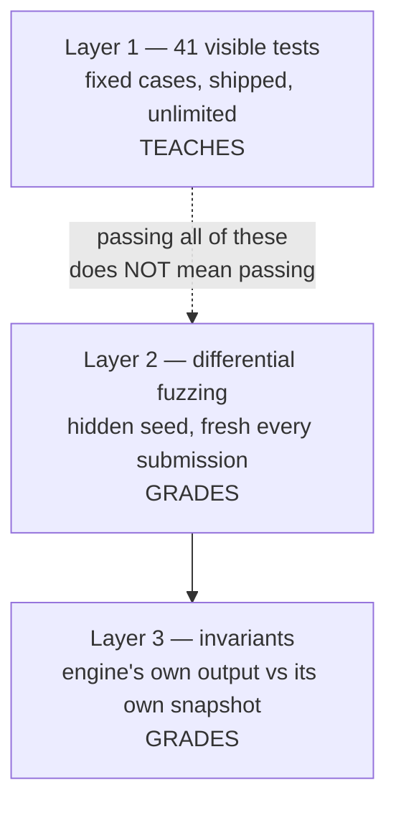

# The tests

952 lines across 4 files. Two things live here and they do opposite jobs:

- **41 visible tests** — one per spec rule, shipped to participants. These
  *teach*. They do not grade.
- **5 engines built to fail** — one per layer of the gate. These prove the gate
  catches what it claims to.

For the harness that runs them see [../harness/HARNESS.md](../harness/HARNESS.md).

---

## 1. Why the visible tests are not the gate

Three layers of correctness, and only the last two decide eligibility:



The visible tests are a fixed, published set. If they were the gate, the winning
strategy would be to satisfy exactly those 41 cases and delete everything else —
the "optimise by deleting checks" exploit the plan names. So they are
deliberately weaker than the gate, and the runner says so out loud on failure:

```
These are the visible tests (SPEC section 4, layer 1). They teach the rules;
they do not grade. The correctness gate is differential fuzzing on a hidden seed.
```

The **shipped skeleton scores 2/41**, which is the intended starting state.

---

## 2. Files

| File | | Role |
|---|--:|---|
| `spec_tests.cpp` | 728 | the 41 cases, plus a tiny comparison harness |
| `spec_tests.h` | 35 | `EngineFactory`, `TestResult`, `run_all_spec_tests` |
| `run_tests_main.cpp` | 75 | human output and `--json` for the editor's Run panel |
| `mutants.cpp` | 114 | five deliberately broken engines |

---

## 3. Written once, run in three places

```cpp
using EngineFactory = std::function<IMatchingEngine*()>;
std::vector<TestResult> run_all_spec_tests(const EngineFactory& make_engine);
```

The tests are written against `IMatchingEngine`, never against the reference, so
the same file runs:

- **server-side against the reference** — a regression suite for the oracle
- **in the boilerplate zip** against the participant's engine (`make test`)
- **behind the editor's Run button**, via `run_tests --json`

Every case gets a **fresh engine**:

```cpp
for (const Case& c : kCases) {
  IMatchingEngine* engine = make_engine();
  std::string detail = c.fn(*engine);
  delete engine;
  ...
}
```

so no case can pass or fail because of state another one left behind.

---

## 4. Comparing against the frozen helpers, on purpose

Expected outputs are built with the same `out::` constructors from the frozen
header that an engine would use:

```cpp
return diff(r.ev, {out::ack(2, rf(3, 77, 3), 10005, Side::Buy),
                   out::trade(2, rf(7, 12, 7), rf(3, 77, 3), 9999, 100, Side::Buy)});
```

and compared field by field:

```cpp
bool same(const OutEvent& a, const OutEvent& b) {
  return a.in_seq == b.in_seq && a.maker == b.maker && a.taker == b.taker &&
         a.price == b.price && a.qty == b.qty && a.type == b.type &&
         a.aggressor_side == b.aggressor_side && a.reason == b.reason;
}
```

**Every field, including the ones that must be zeroed.** That is deliberate and
it matters: the benchmark digest folds every field too, so a test that ignored
`maker` on an `Ack` would pass code that fails the ranked run. The visible tests
would then be actively misleading — worse than absent.

Failure output shows both sides, aligned, with the offending row marked:

```
output mismatch (2 expected, 1 emitted)
    #0
      expected: Ack in_seq=2 price=10000 qty=0 maker=(s0,c0,f0) taker=(s2,c2,f2) side=Buy
      actual:   Ack in_seq=2 price=10000 qty=0 maker=(s0,c0,f0) taker=(s2,c2,f2) side=Buy
  > #1
      expected: Trade 100 @ 10000 ...
      actual:   <nothing>
```

Book state is asserted through the same public `snapshot()` participants
implement:

```cpp
std::string expect_book(IMatchingEngine& e, uint32_t n_bids, uint32_t n_asks,
                        uint64_t total_qty, uint32_t total_orders);
```

---

## 5. The 41 cases

| Test | Rule |
|---|---|
| `ack_only_for_non_marketable_limit` | A1, A4 |
| `ack_precedes_trades` | A1 |
| `trade_price_is_the_resting_price` | §3.1 |
| `price_priority_best_first` | §3.1 |
| `time_priority_fifo_within_level` | §3.1 |
| `partial_fill_resting_order_survives` | §3.1 |
| `marketable_limit_rests_remainder_silently` | A4 |
| `limit_order_respects_its_limit_price` | §3.1 |
| `book_is_never_left_crossed` | §4 invariants |
| `market_order_acks_on_receipt` | M1, M4 |
| `market_sweeps_at_each_resting_price` | M2 |
| `market_into_empty_book_expires` | M3, M4 |
| `market_partial_expires_remainder` | M3 |
| `market_order_never_rests` | M1 |
| `ioc_with_no_liquidity_expires` | A4 |
| `ioc_partial_fill_expires_remainder` | A2, A4 |
| `ioc_full_fill_emits_no_expired` | A4 |
| `cancel_live_order` | §3.4 |
| `cancel_carries_remaining_not_original` | §3.4 |
| `cancel_unknown_id_rejects` | §3.4 |
| `cancel_already_filled_rejects` | §3.4 |
| `second_cancel_of_same_order_rejects` | §3.4 |
| `cancel_identity_is_session_plus_coid` | §1 |
| `cancelling_last_order_removes_level` | §3.1 |
| `snapshot_front_seq_proves_fifo` | §2.4 |
| `stp_keys_on_firm_not_session` | S1 |
| `stp_cancels_resting_aggressor_continues` | S2, S3 |
| `stp_cancelack_interleaved_in_walk_order` | S5 |
| `cancel_after_stp_removal_rejects` | §3.4 |
| `ioc_meeting_only_own_liquidity_expires_full` | I1 |
| `fok_fillable_commits` | F3, F4 |
| `fok_unfillable_rejects_with_no_ack` | F2, A3 |
| `fok_fillability_bounded_by_limit_price` | F1 |
| `fok_excludes_same_firm_liquidity_60_50_100` | F1 |
| `fok_commits_with_stp_cancels_interleaved` | F3 |
| `fok_counts_remaining_not_original_qty` | F1 |
| `fok_exact_fill` | F4 |
| `fok_against_empty_book_rejects` | F2 |
| `fok_fills_across_multiple_levels` | F1, F3 |
| `sell_side_aggressor_mirrors_buy_side` | §3.1 |
| `sell_market_sweeps_bids_highest_first` | M2 |

Nine of them are FOK. That is not padding — FOK is the heaviest required
feature, the one that needs check-then-commit rather than greedy matching, and
the designated cut if the dry run says the scope is too big.

### The cases that carry the most weight

**`trade_price_is_the_resting_price`** — the most common first-submission
failure, every time. The aggressor bids 10005 into a resting ask at 9999; the
trade must print 9999.

**`cancel_identity_is_session_plus_coid`** — session 3 and session 7 both hold
`coid = 1`, with *different quantities* so the outcomes are distinguishable.
An engine keyed on the id alone cancels the wrong order and reports 100 instead
of 50. Quantities differ precisely so a wrong engine cannot pass.

**`fok_excludes_same_firm_liquidity_60_50_100`** — the worked example from the
spec, and the only visible case that separates rule F1 from the obvious
implementation:

```cpp
e.on_new(ord(1, Side::Sell, 10000, 60, 1, 1, 6), r);   // firm B: 60
e.on_new(ord(2, Side::Sell, 10000, 50, 2, 2, 5), r);   // firm A: 50
e.on_new(ord(3, Side::Buy, 10000, 100, 3, 3, 5, TIF::FOK), r);   // firm A wants 100
// expect: exactly one Reject/FokUnfillable, and BOTH still resting
```

Counting all 110 commits, then STP cancels A's own 50 mid-match, and only 60
fills — a partially filled FOK, which F4 forbids.

**`snapshot_front_seq_proves_fifo`** — three orders at one price, seq 11/12/13.
Asserts `front_seq == 11`, then cancels the head and asserts it becomes 12.
`total_qty` and `order_count` are **identical** for FIFO and LIFO; only the head
seq tells them apart.

**`stp_cancelack_interleaved_in_walk_order`** — book-walk order is `Trade(B),
CancelAck(own), Trade(C)`, and that is the exact required output order. It pins
S5, which an engine that batches its STP cancels would fail.

**`sell_side_aggressor_mirrors_buy_side`** and
`sell_market_sweeps_bids_highest_first` exist because everything else is
buy-side. They catch an engine that hardcoded one direction — best bid is the
*highest* price, best ask the *lowest*, and getting that backwards passes every
other test.

### One weak test, stated plainly

`market_order_never_rests` asserts only that the book is empty afterwards, so it
would also pass for an engine that does nothing at all. It is one of the two the
skeleton "passes" — vacuously.

It is not wrong (asserting absence is the only way to state "never rests") and
M2/M3 are properly covered by three other market cases, but on its own it cannot
distinguish a correct engine from an empty one. The honest reading of the
skeleton's 2/41 is that **one** rule is genuinely satisfied — the pre-wired
`Ack` — and one is an artefact.

---

## 6. The five engines built to fail

A gate that has only ever seen correct engines has not been tested. Selected by
the `MEBENCH_MUTANT` environment variable so one shared object covers them all;
never shipped to participants.

Each wraps the reference and corrupts one thing, so what is being tested is the
*gate*, not a second implementation:

```cpp
class FilterSink final : public OutSink {
  void emit(const OutEvent& e) noexcept override {
    OutEvent out = e;
    switch (m_) {
      case Mutation::TradeAtAggressorPrice:
        if (out.type == OutType::Trade && aggressor_px_ != 0) out.price = aggressor_px_;
        break;
      case Mutation::SwallowExpired:
        if (out.type == OutType::Expired) return;          // silently drop it
      case Mutation::SelfTrade:
        if (out.type == OutType::Trade) out.maker.participant_id = out.taker.participant_id;
      ...
```

| Mutant | Corruption | Caught by |
|---|---|---|
| `trade_price` | trade at the aggressor's price | output diff **and** invariant layer |
| `swallow_expired` | drop every `Expired` | output diff **and** invariant layer |
| `self_trade` | forge maker's firm to equal taker's | invariant layer |
| `lying_snapshot` | claim 1 more resting unit than emitted | snapshot cross-check |
| `hang` | spin forever at seq ≥ 20000 | wall-clock timeout |

All five are ctest cases with `WILL_FAIL TRUE`:

```cmake
foreach(mutant trade_price swallow_expired self_trade lying_snapshot hang)
  add_test(NAME mutant_caught_${mutant} COMMAND harness verify ... )
  set_tests_properties(mutant_caught_${mutant} PROPERTIES
    ENVIRONMENT "MEBENCH_MUTANT=${mutant}" WILL_FAIL TRUE TIMEOUT 120)
endforeach()
```

In practice they shrink from a 50,000-event stream to **1–19 events**.

### What they found

They are not decoration — they found two real bugs in the harness:

**The divergence report omitted `participant_id`.** The forged self-trade
printed `expected` and `actual` lines that read **identically**:

```
expected: TRADE 20 @ 10003  maker=(s11,c2)  taker=(s20,c1)
actual:   TRADE 20 @ 10003  maker=(s11,c2)  taker=(s20,c1)
```

STP keys on that field, so a divergence can live entirely inside it. The firm is
now always shown.

**The wall-clock limit could never fire for a real infinite loop.** The in-loop
deadline only runs *between* events; an engine stuck inside `on_new` never
returns control. The `hang` mutant passed cleanly — the test was lying — until
enforcement moved to an async-signal-safe `SIGALRM` handler.

One test of my own was also wrong: `stp_keys_on_firm_not_session` originally
expected an `Expired` after the STP cancel, but the aggressor was a **GTC**
order, whose remainder rests silently. The reference was right and the test was
wrong. Which is the point of having the reference and the tests disagree
loudly.

---

## 7. The Run panel contract

```cpp
std::printf("{\"total\":%zu,\"passed\":%zu,\"tests\":[", results.size(), passed);
// per test: {"name":..., "rule":..., "passed":..., "detail":...}
```

`--json` is what the editor's Run button parses. Every string is escaped —
`detail` carries multi-line compiler-style output with quotes and newlines in it.

`rule` travels with every result on purpose. A failing test name tells you
*what* broke; the rule tag tells you **which paragraph of the spec to reread**,
which is the difference between a red X and a next step.

Exit code is `0` only if all pass, so `ctest` and `make test` work without
parsing anything.

---

## 8. Constraints worth keeping

- **Keep comparing every field**, including zeroed ones. The moment a test
  ignores a field the digest folds, the visible tests start passing code that
  fails the ranked run.
- **Never write a test against the reference's internals.** They run against
  `IMatchingEngine` in the boilerplate too; anything else would not compile
  there.
- **Adding a rule to the spec means adding a case here.** The rule tag column is
  the audit: a spec rule with no test is a rule nobody checks until the fuzzer
  happens to hit it.
- **Mutants must stay wrappers around the reference.** A hand-written broken
  engine would test the gate against a second implementation's bugs rather than
  against one precise corruption.
